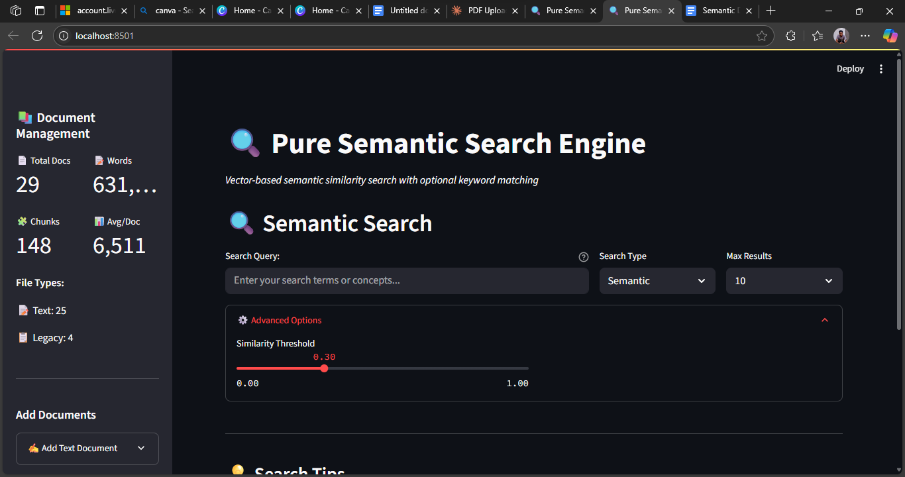

# Semantic Search Engine

A modern, vector-based semantic search engine built with Streamlit, Neo4j AuraDB, and Sentence Transformers. This project enables you to upload, index, and search documents (PDF or text) using semantic similarity, keyword, or hybrid approaches.

---

## Features

- **Semantic Search:** Finds relevant content based on meaning, not just keywords.
- **Keyword Search:** Classic full-text search for exact matches.
- **Hybrid Search:** Combines semantic and keyword results for comprehensive retrieval.
- **PDF/Text Upload:** Supports uploading and chunking of PDF and text files.
- **Neo4j Integration:** Stores documents and semantic chunks as a graph for efficient querying.
- **Streamlit UI:** User-friendly web interface for uploading, searching, and exploring results.
- **Document Stats:** Visualizes document and chunk statistics in real time.

---

## Architecture

- **Frontend:** Streamlit app for uploading, searching, and displaying results.
- **Backend:** Python logic for chunking, embedding, and storing documents.
- **Database:** Neo4j AuraDB for graph storage and vector search.
- **Embeddings:** Sentence Transformers (`all-MiniLM-L6-v2`) for semantic representation.

---

## Screenshots & Images

> Place your screenshots or diagrams in the `images/` folder.



---

## Getting Started

### Prerequisites

- Python 3.8+
- Neo4j AuraDB instance ([sign up](https://neo4j.com/cloud/aura/))
- MongoDB Atlas (optional, if you extend for document storage)
- [Groq API key](https://groq.com/) (if using Groq for embeddings)
- `pip install -r requirements.txt`

### Installation

1. **Clone the repository:**
    ```sh
    git clone https://github.com/yourusername/semantic_search.git
    cd semantic_search
    ```

2. **Install dependencies:**
    ```sh
    pip install -r requirements.txt
    ```

3. **Configure environment variables:**
    - Copy `.env.example` to `.env` and fill in your credentials:
      ```
      NEO4J_URI=neo4j+s://<your-neo4j-uri>
      NEO4J_USER=neo4j
      NEO4J_PASSWORD=<your-password>
      EMBEDDING_MODEL=all-MiniLM-L6-v2
      VECTOR_DIMENSION=384
    
      ```

4. **Run the app:**
    ```sh
    streamlit run main.py
    ```

---

## Usage

- **Upload Documents:** Use the sidebar to upload PDF or text files, or paste text directly.
- **Search:** Enter a query and select search type (Semantic, Keyword, Hybrid).
- **Explore Results:** Expand results to see context, metadata, and highlighted matches.
- **View Stats:** Sidebar shows document, chunk, and word statistics.

---

## Configuration

All sensitive credentials and settings are managed via the `.env` file. Never commit your `.env` file to version control.

---

## Links

- [Live Demo](https://semantic-search-test.streamlit.app/) <!-- Replace with your deployed app link -->
- [Research](https://docs.google.com/document/d/1PtnLlTghRO3ObEiRz1lWOr1ZGiHvP4qUrssbldF9dHs/edit?pli=1&tab=t.0#heading=h.ycwl6rfjhudb) <!-- Add documentation link if available -->

---

## Contributing

Contributions are welcome! Please:

1. Fork the repository.
2. Create a new branch for your feature or bugfix.
3. Submit a pull request with a clear description.

---

## License

This project is licensed under the MIT License. See [LICENSE](LICENSE) for details.